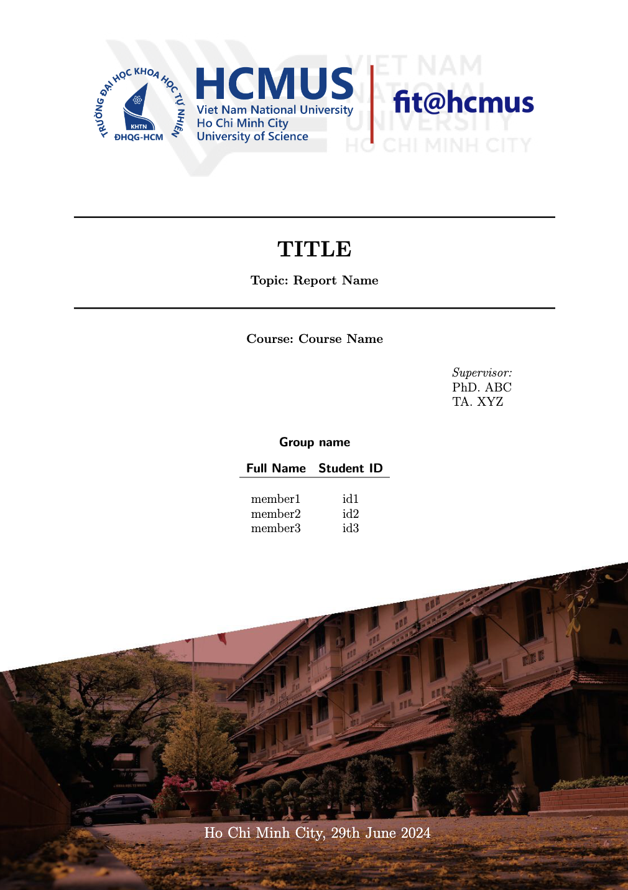

# FIT@VNUHCM-US Report Template

This repository contains a LaTeX template for writing reports, specifically tailored for VNUHCM-US students. The structure is organized to help you efficiently compile your report with various sections, including sorting algorithms and their evaluations.

This template is designed based on references from various reports, and the cover page is created using Python libraries.

<p align="center">
  
</p>

## Repository Structure

```
.
├── Appendix
│   └── appendix.tex
├── Contents
│   ├── 0. Frontpage.tex
│   ├── 0. List of symbols.tex
│   ├── 0. introduction.tex
│   ├── How_to_compile
│   │   └── compile.tex
│   ├── ProjectOrganization_ProgrammingNote
│   │   ├── programmingNote.tex
│   │   └── programmingOrganization.tex
│   ├── SortingAlgorithms
│   │   ├── 1. selection.tex
│   │   ├── 10. b_insertion.tex
│   │   ├── 11. shaker.tex
│   │   ├── 12. flash.tex
│   │   ├── 2. insertion.tex
│   │   ├── 3. shell.tex
│   │   ├── 4. bubble.tex
│   │   ├── 5. heap.tex
│   │   ├── 6. merge.tex
│   │   ├── 7. quick.tex
│   │   ├── 8. radix.tex
│   │   └── 9. counting.tex
│   └── Survey_Evaluation
│       ├── NearlySortedOrder.tex
│       ├── RandomOrder.tex
│       ├── ReverseOrder.tex
│       └── SortedOrder.tex
├── Figures
│   ├── 0. General
│   │   ├── VNU.png
│   │   ├── VNU_gray.png
│   │   ├── fit.png
│   │   ├── fit@hcmus.png
│   │   ├── fixed.jpeg
│   │   ├── folder.png
│   │   ├── hcmus.png
│   │   ├── hcmus_gray.png
│   │   └── tree_folder.png
│   ├── Visualization
│   │   ├── Nearly_compare.png
│   │   ├── Nearly_time.png
│   │   ├── Random_compare.png
│   │   ├── Random_time.png
│   │   ├── Reverse_compare.png
│   │   ├── Reverse_time.png
│   │   ├── Sorted_compare.png
│   │   └── Sorted_time.png
│   └── sort_demo
│       ├── bubble.png
│       ├── insertion.png
│       ├── merge.png
│       ├── quick_1.png
│       ├── quick_2.png
│       ├── quick_3.png
│       ├── radix.png
│       └── shell.png
├── General
│   ├── Preamble.tex
│   └── Settings.tex
├── README.md
├── Report.pdf
├── main.tex
└── ref
    ├── References.bib
    └── References.tex
```

### Description of Key Files and Directories

- **Appendix**
  - `appendix.tex`: Contains supplementary material and appendices.

- **Contents**
  - `0. Frontpage.tex`: Front page of the report.
  - `0. List of symbols.tex`: List of symbols used in the report.
  - `0. introduction.tex`: Introduction section.
  - `How_to_compile/compile.tex`: Instructions on how to compile the report.
  - `ProjectOrganization_ProgrammingNote/programmingNote.tex`: Programming notes.
  - `ProjectOrganization_ProgrammingNote/programmingOrganization.tex`: Project organization notes.
  - `SortingAlgorithms/`: Contains individual sections for different sorting algorithms.

- **Figures**
  - `0. General/`: General figures used in the report.
  - `Visualization/`: Figures related to the visualization of sorting algorithms.
  - `sort_demo/`: Demonstration images for sorting algorithms.

- **General**
  - `Preamble.tex`: Contains preamble settings for the LaTeX document.
  - `Settings.tex`: General settings for the document.

- **References**
  - `References.bib`: Bibliography file.
  - `References.tex`: References section.

- **Main Files**
  - `README.md`: This file.
  - `Report.pdf`: Compiled version of the report.
  - `main.tex`: Main LaTeX file to compile the report.

## How to Compile

1. Ensure you have LaTeX installed on your system.
2. Navigate to the project directory.
3. Run the following command to compile the report:
   ```sh
   pdflatex main.tex
   ```
4. To include references, run:
   ```sh
   bibtex main.aux
   pdflatex main.tex
   pdflatex main.tex
   ```

## Contribution

Feel free to contribute to this template by submitting pull requests or opening issues for any bugs or enhancements.

---

## License

This template is licensed under the MIT License. See the [MIT LICENSE](LICENSE) file for more details.
